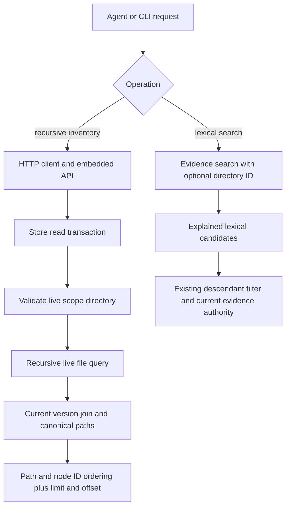

# Scoped Document Inventory - Plan

## Goal Capsule

- **Objective:** Agents can enumerate every live document in a vault or directory subtree and can constrain lexical document search to that subtree without encoding scope as query text or traversing directories one level at a time.
- **Means:** Add a recursive, paginated document inventory contract and expose stable directory scope on agent lexical search (KTD1, KTD2, KTD4).
- **Authority:** The GitHub issue and Product Contract define behavior; current node/version rows remain authoritative for returned metadata; repository invariants govern implementation.
- **Execution profile:** Code change in one producer repository and one pull request.
- **Stop conditions:** Stop if the implementation would weaken vault isolation, include trashed or historical-only documents, or require a new continuation model that conflicts with active item-2 work.
- **Finish and ship:** The implementation agent verifies both SQLite modes, documentation, lint, and repository hooks, then opens a pull request and waits for CI to reach a decided result without merging.

---

## Product Contract

### Summary

DocBank will expose a first-class recursive document inventory operation at vault root or under one live directory. Agent lexical search will accept the same stable directory identity as an optional scope. Direct-child browsing remains a separate operation.

### Problem Frame

Existing lower-layer text search accepts `under_node_id`, but agents cannot yet pass that scope through `search_documents`, and they cannot request a bounded recursive inventory. Supplying `*` or an absolute path as search text is lexical search and therefore cannot stand in for browse-all behavior.

### Requirements

**Inventory behavior**

- R1. A caller can request one bounded page of all live file nodes in the vault, ordered deterministically by canonical path with node ID as the final tie-breaker.
- R2. A caller can supply one resolved live directory node ID and receive only live file descendants of that directory; the directory itself is never an item.
- R3. Each inventory item carries canonical path, stable node identity, current content-version identity, current blob and media metadata, size, revision, and timestamps so an agent can choose what to inspect next.
- R4. Inventory responses carry the resolved scope directory plus `total`, `limit`, `offset`, `next_offset`, and `truncated`; each request is a current read snapshot, while later offset pages reconcile against then-current live authority and may shift after moves, deletion, or insertion.

**Agent search and navigation**

- R5. An agent can resolve an absolute virtual directory path to a vault-qualified stable directory identity, then pass that identity to inventory or `search_documents` and receive only current descendant documents.
- R6. Empty search text, `*`, and absolute paths do not become inventory shortcuts; CLI and agent documentation direct browse-all callers to the inventory operation.
- R7. Immediate-child listing keeps its existing non-recursive behavior and contract.

**Safety and scope**

- R8. Inventory and scoped search exclude trashed nodes, exclude directories from inventory items, and bind every file to its current content version.
- R9. Agent scope inputs pair `vault_id` with `under_node_id`; a vault mismatch, missing node, trashed node, or non-directory node fails closed before traversal, and MCP remains bound to the vault selected at process startup.

### Acceptance Examples

- AE1. **Covers R1, R3, R4, R8.** Given a vault with files at root and in nested folders, when an agent pages through root inventory, then every live file appears once in canonical path order with current node/version metadata and no directory or trash item appears.
- AE2. **Covers R2, R4, R8, R9.** Given `/finance` and a sibling tree, when an agent resolves `/finance` and inventories with its returned vault and node IDs, then only live descendant files are returned across pages; a foreign vault ID, file scope ID, or unknown ID is rejected.
- AE3. **Covers R4.** Given a file is moved or trashed between offset requests, when the next page is read, then it reflects current authority and the documented reconciliation caveat explains that callers needing a refreshed complete set should restart at offset zero.
- AE4. **Covers R5, R8, R9.** Given the same query matches inside and outside `/finance`, when `search_documents` receives the vault-qualified `/finance` identity returned by directory resolution, then only current descendant evidence is returned and the response echoes the scope identity.
- AE5. **Covers R6, R7.** Given an agent wants all documents, when it inspects tool and CLI help, then it selects recursive inventory rather than `search_documents("*")` or repeated direct-child calls.

### Scope Boundaries

In scope: store, embedded API, daemon HTTP API, Go client, CLI, MCP tools, OpenAPI, and agent/user documentation needed for recursive inventory and scoped lexical search.

Outside this product change: semantic or hybrid search, snapshot tokens, feature flags, compatibility shims, migration machinery, PersonalOS changes, and changes to direct-child browsing.

---

## Planning Contract

### Key Technical Decisions

- KTD1. **Inventory is a distinct recursive read contract.** Reuse a recursive CTE and stable node identity, but do not overload lexical search or `children`; this preserves the caller's choice between immediate navigation and a more expensive subtree inventory. Governs R1, R2, R6, R7.
- KTD2. **Inventory uses ordinary offset paging over current authority.** Each request runs in one read transaction and returns scope, count, and page from that snapshot. `next_offset` and `truncated` match the shared agent continuation vocabulary established by search pagination. Pages do not promise a multi-request snapshot; callers restart from offset zero when they require reconciliation after tree changes. Governs R3, R4, R8.
- KTD3. **Canonical path is the inventory sort key.** Build paths in SQL for all live descendants and sort by path, then node ID. This gives agents deterministic traversal independent of directory-first child ordering. Governs R1, R3.
- KTD4. **Scoped MCP search extends evidence-bearing lexical search.** Thread `under_node_id` through the evidence endpoint and client into the existing explained lexical candidate query, preserving evidence identity and current-version filtering instead of downgrading the tool to the less informative general search response. Agent inputs also carry the expected vault ID and reject a mismatch before resolving the node. Governs R5, R8, R9.
- KTD5. **Root scope is explicit and selected scopes are vault-qualified.** An omitted inventory scope selects the store root; agent-selected scope pairs the process vault ID with a positive live directory ID. Responses return the vault ID, resolved directory node, and canonical path so callers can preserve authority across later calls. Governs R1, R2, R4, R9.

### High-Level Technical Design

The inventory route returns a complete metadata page rather than evidence excerpts. Scoped search keeps its ranked evidence response. Both validate scope inside the same vault-backed store, and both apply current live authority at request time.

### Assumptions

- The user-requested direct roll-forward contract permits additive HTTP, client, CLI, and MCP surface changes without compatibility modes.
- Inventory follows the repository's shared `offset`, `next_offset`, and `truncated` continuation contract rather than creating a separate cursor.
- A `list-documents` CLI command is clearer than adding recursion to `ls`, because `ls` remains the immediate-child primitive.
- MCP directory resolution is a thin projection of the existing absolute-path stat operation; it does not introduce a second path authority.

### System-Wide Impact

The new query crosses storage, public embedded API, daemon HTTP/OpenAPI, client validation, CLI, and MCP. It changes no schema or write path. Query cost grows with the selected subtree, but every response remains bounded and the database performs one recursive traversal per page instead of forcing agents to make one request per directory.

### Risks & Dependencies

- Offset pages can omit or repeat an item if tree membership changes between calls. R4 makes that reconciliation model explicit and avoids implying snapshot durability that SQLite requests do not provide.
- Canonical path construction must preserve existing path rules and work in both SQLite drivers. Tests must cover root files, nested files, moves, trash, Unicode names, and ordering ties.
- The repository requires Go 1.27+ and the `fts5` build tag. Both CGO and pure-Go SQLite suites are release gates.

### Sources & Research

- GitHub issue #14 defines the inventory outcome, safety boundary, and acceptance examples.
- `internal/store/node.go` supplies the one-transaction directory validation and paging pattern.
- `internal/store/search.go` supplies the recursive descendant filter and current-version search authority.
- `internal/api/routes_read.go`, `internal/client/client.go`, and `internal/mcp/server.go` show the existing HTTP, client validation, and agent tool conventions.
- No active pull request or remote branch exists for issue #13, so no continuation shape was available to reuse.

---

## Implementation Units

### U1. Recursive inventory authority

- **Goal:** Add the store and embedded-library contract that returns one current, deterministic page of live documents for root or a selected directory.
- **Requirements:** R1, R2, R3, R4, R8, R9; AE1, AE2, AE3.
- **Dependencies:** None.
- **Files:** `internal/store/node.go`, `internal/store/node_test.go`, `types.go`, `vault.go`, `vault_test.go`.
- **Approach:** Add an inventory page view that validates the scope as a live directory, constructs canonical descendant paths in a recursive CTE, joins only current file versions, computes total and page in one read transaction, and orders by path plus node ID. Map that view to the public embedded type with the resolved scope and paginated document items.
- **Execution note:** Start with failing store tests for root and scoped pages before adding the query.
- **Patterns to follow:** `DirectoryChildrenPage`, `nodeViewForNode`, `fromStoreNode`, and ordinary `Limit`/`Offset` option types.
- **Test scenarios:**
  - Covers AE1. Root inventory returns root and nested live files in canonical path order, with current version, blob, media type, revision, size, and timestamps.
  - Covers AE2. A selected directory excludes sibling and ancestor files while including all nested descendants across multiple offsets.
  - Covers AE3. Moving, replacing, and trashing files between requests causes a restarted page to reflect current path and version authority; an out-of-range offset returns an empty page with the current total.
  - Root, missing, trashed, and file scope identities produce the expected success or existing typed error.
  - CGO and pure-Go SQLite return the same order for Unicode names and equal display names under different parents.
- **Verification:** Store and embedded API tests prove scope validation, metadata authority, deterministic paging, and trash exclusion in both SQLite modes.

### U2. Daemon, client, and CLI inventory surface

- **Goal:** Expose recursive inventory as a bounded HTTP/client/CLI operation that is visibly distinct from direct-child listing.
- **Requirements:** R1, R2, R3, R4, R6, R7, R8, R9; AE1, AE2, AE3, AE5.
- **Dependencies:** U1.
- **Files:** `internal/api/types.go`, `internal/api/routes_read.go`, `internal/api/routes_read_test.go`, `internal/api/openapi_test.go`, `internal/client/client.go`, `internal/client/client_test.go`, `cmd/docbank/root.go`, `cmd/docbank/list_documents.go`, `cmd/docbank/cli_test.go`, `docs/architecture/http-api.md`, `docs/cli-reference.md`, `docs/usage/organizing.md`.
- **Approach:** Add a read endpoint and page type that accept optional `under_node_id`, `limit`, and `offset`, echo the vault and resolved scope, report `next_offset` and `truncated`, and validate the response in the client. Add `docbank list-documents [path-or-id]` with pagination flags and JSON output; resolve the optional selector before calling the inventory endpoint. Leave `ls` unchanged and update help to distinguish both operations.
- **Execution note:** Drive the endpoint and client shape from failing integration tests, then add the thin CLI wrapper.
- **Patterns to follow:** `/nodes/{id}/children`, `Client.ChildrenPage`, `nodeSelector`, CLI JSON envelopes, and generated OpenAPI assertions.
- **Test scenarios:**
  - Root HTTP and client calls return the exact U1 page envelope and reject invalid pagination bounds.
  - Scoped HTTP and CLI calls resolve a directory once, return only descendant files, and reject file or missing scopes without falling back to root.
  - An unknown node ID fails through the configured vault's normal not-found boundary; the response and client validation retain the selected vault identity.
  - CLI text and JSON output include stable selector, version/path metadata, total, limit, offset, next offset, and truncation state, while `ls` remains immediate-only.
  - CLI help does not suggest `*` or a path as search text and directs recursive discovery to `list-documents`.
- **Verification:** API, client, CLI, OpenAPI, and strict documentation tests prove the contract and its discoverability.

### U3. Agent inventory and directory-scoped lexical search

- **Goal:** Let MCP agents enumerate document pages and constrain evidence-bearing lexical search with the same resolved directory identity.
- **Requirements:** R2, R3, R4, R5, R6, R8, R9; AE2, AE4, AE5.
- **Dependencies:** U2.
- **Files:** `internal/api/types.go`, `internal/api/routes_read.go`, `internal/api/routes_read_test.go`, `internal/client/client.go`, `internal/client/client_test.go`, `internal/mcp/server.go`, `internal/mcp/server_test.go`, `docs/agents/integration.md`, `docs/agents.md`, `docs/architecture/http-api.md`.
- **Approach:** Add `resolve_directory` over the existing absolute-path stat client so an agent can obtain a canonical path, `vault_id`, and stable directory node ID. Add `list_documents` with optional vault-qualified `under_node_id`, `limit`, and `offset`, backed by the inventory client. Add the same optional scope to `search_documents`, evidence HTTP input, evidence report authority, and client validation, threading the node ID into existing `SearchExplainedLexicalCandidates` options after the vault check. Tool descriptions must state that inventory is the browse-all operation and search query text stays lexical.
- **Execution note:** Write MCP contract tests using a synthetic daemon before changing tool registration.
- **Patterns to follow:** Existing MCP read tools, `daemonCall`, evidence-search validation, and the store's `UnderNodeID` normalization.
- **Test scenarios:**
  - Covers AE2. `resolve_directory` resolves `/finance`; `list_documents` with no scope enumerates the vault, while the returned vault and directory IDs enumerate only nested live files across offsets.
  - Covers AE4. `search_documents` with the resolved vault and directory IDs excludes an otherwise matching sibling result and echoes both parts of the selected scope in the evidence report.
  - Two vaults with colliding directory node IDs reject a scope whose `vault_id` does not match the process-selected vault.
  - Invalid, missing, trashed, and non-directory scope IDs return a bounded MCP tool error without leaking daemon details.
  - Tool discovery exposes `list_documents` separately from existing immediate-child and search semantics, and its schemas enforce positive scope IDs and bounded offsets.
  - A literal `*`, an absolute path, and an empty query are rejected or treated only under lexical-query rules; none invokes inventory implicitly.
- **Verification:** MCP in-memory integration tests exercise concrete root inventory, scoped inventory, and scoped lexical search calls against the daemon surface.

---

## Verification Contract

| Gate | Applies to | Done signal |
| --- | --- | --- |
| Targeted store, API, client, CLI, and MCP tests with `-tags fts5` | U1-U3 | New scenarios pass with CGO SQLite. |
| `CGO_ENABLED=0 go test -tags fts5 ./...` | U1-U3 | Complete pure-Go suite passes. |
| `make test` | U1-U3 | Complete repository Go and release-script suite passes with CGO. |
| `make lint` | U1-U3 | Go lint passes with the required build tag. |
| `make docs-build` | U2-U3 | Strict documentation build has no warnings or broken generated contract. |
| `prek run` | U1-U3 | Repository hooks pass before every commit. |
| MCP integration proof | U3 | Root inventory, directory inventory, and directory-scoped text search succeed through concrete tool calls. |

---

## Definition of Done

- U1 returns a deterministic, bounded, current-authority inventory page for root and selected live directories without schema changes.
- U2 exposes the same contract through embedded API, daemon HTTP/OpenAPI, Go client, and a dedicated CLI command while preserving `ls` semantics.
- U3 exposes MCP directory resolution, a separate inventory tool, and vault-qualified evidence-search scope without magic query text.
- All requirements and acceptance examples have automated coverage at the owning layer, including trash, invalid scope, move/delete reconciliation, and both SQLite implementations.
- User and agent documentation explain direct-child listing, recursive inventory, lexical search, and offset reconciliation in plain terms.
- The branch contains no abandoned experiments, compatibility scaffolding, feature flags, rollout machinery, or unrelated cleanup.
- A human-readable pull request links issue #14, contains concrete agent call examples, and reaches a decided CI result without being merged.
