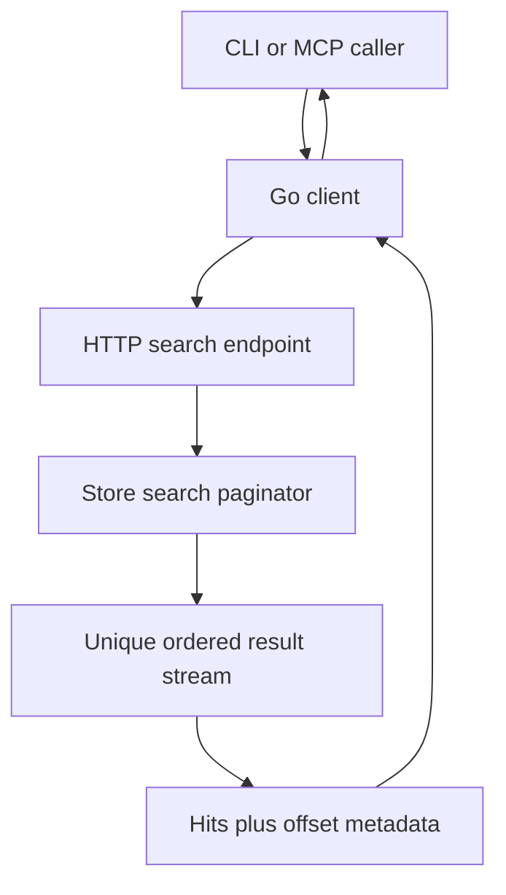
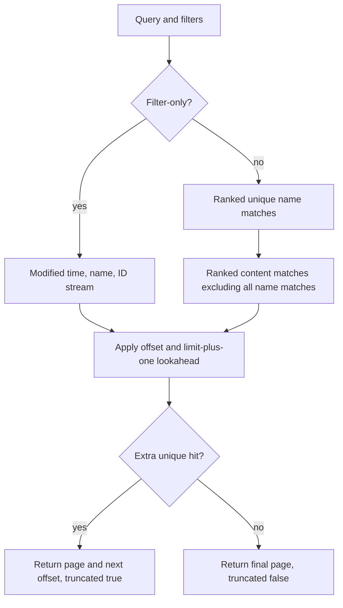

# Search Offset Pagination - Plan

## Goal Capsule

- **Objective:** Agents and CLI users can enumerate every ordinary or evidence-bearing lexical search result and know when the result stream is exhausted.
- **Means:** Add one zero-based offset contract over each endpoint's final deterministic result order, with explicit continuation metadata (KTD1, KTD2).
- **Authority:** The user request and GitHub issue #13 define product scope; existing search ordering, filters, evidence identities, and repository instructions remain authoritative implementation constraints.
- **Execution profile:** Implement, simplify, independently review, test, and open a pull request without merging or deploying.
- **Stop conditions:** Stop if offset pagination cannot preserve the existing unique name-before-content order without changing evidence identity, filters, or bounded output.

---

## Product Contract

### Summary

Add usable numeric pagination to ordinary document search and lexical evidence search, then expose the same continuation contract through the existing Go client, CLI, OpenAPI, and DocBank MCP tool.

### Problem Frame

Search responses currently return a bounded `limit` and `truncated`, but callers cannot request the next results.
An agent therefore reaches a dead end whenever `truncated` is true, even though the underlying result order is deterministic while the vault state is unchanged.

### Requirements

**Continuation contract**

- R1. `GET /api/v1/search` and `GET /api/v1/evidence/search` accept a non-negative `offset` that defaults to `0`.
- R2. Both responses echo `offset`, return `next_offset`, and retain `truncated`; callers follow `next_offset` only while `truncated` is true.
- R3. `next_offset` equals `offset + len(hits)`, including the terminal page; an offset at or beyond the end returns an empty hit array, the requested offset, the same `next_offset`, and `truncated: false`.
- R4. `truncated` is true only when another unique result exists after the returned page.

**Search semantics**

- R5. Ranked search offsets apply to one final unique stream: all name matches in the existing BM25/name/ID order, followed by content-only matches in their existing rank/name/ID order.
- R6. Filter-only search retains its current modification-time-descending/name/ID order and composes offset with every existing filter.
- R7. Evidence search offsets count unique documents, not raw matching segments, while preserving the current `node_name`, `content_blob`, and `rendition_segment` identities and bounded excerpts.
- R8. Ordinary search retains tag, MIME type, directory, and modification-time filters, normalized filter echoes, live/current-version rules, and the 1-1000 limit range.
- R9. Evidence search retains lexical-only behavior, immutable hit authority, the 1-100 limit range, and the existing excerpt bound.

**Surface parity**

- R10. The Go client, CLI, generated OpenAPI contract, and MCP `search_documents` tool can request an offset and receive the same pagination metadata as their backing HTTP endpoint.
- R11. CLI human output gives an exact next offset when more results exist; CLI JSON and MCP output expose the structured continuation fields unchanged.
- R12. Existing TUI, browser, semantic, and hybrid retrieval behavior remains at offset zero unless a compile or focused contract adjustment is required.

### Acceptance Examples

- AE1. **Covers R1-R5.** Given a two-result page followed by more ranked hits, requesting the returned `next_offset` yields the next unique hits without overlap while the vault is unchanged.
- AE2. **Covers R5 and R7.** Given an offset that lands at or crosses the name-to-content boundary, the page preserves name-before-content order and does not repeat a document whose name and content both match.
- AE3. **Covers R3-R4.** Given the exact end or an offset beyond it, the endpoint returns an empty terminal page with `truncated: false` rather than an error.
- AE4. **Covers R6 and R8.** Given a filter-only result set with tied modification timestamps, consecutive pages preserve name/ID tie-breaking and the selected filters.
- AE5. **Covers R7 and R9.** Given multiple matching rendition segments for one document, evidence pagination counts the document once and retains its selected immutable evidence identity.
- AE6. **Covers R10-R11.** Given a DocBank MCP caller, the offset is forwarded to evidence search and the response provides the next usable offset until completion.

### Scope Boundaries

The change is a direct contract update. It does not add feature flags, compatibility shims, dual response shapes, migrations, rollout modes, snapshot infrastructure, or rollback machinery.

#### Deferred to Follow-Up Work

- Snapshot or opaque-cursor pagination for mutation-stable enumeration.
- Pagination controls for the TUI or built-in browser.
- PersonalOS consumer changes.
- Semantic search and recursive inventory.

### Sources

- GitHub issue #13, "Make lexical document search evidence-bearing and pageable."
- Existing search implementation and tests in `internal/store/search.go`, `internal/store/search_test.go`, and `internal/api/routes_read_test.go`.
- Existing `limit`/`offset` page contracts in `internal/api/types.go`, `internal/api/routes_read.go`, and `internal/mcp/server.go`.

---

## Planning Contract

### Key Technical Decisions

- KTD1. **Use numeric offsets, not opaque cursors.** The repository already uses `limit`/`offset`, both search partitions have deterministic tie-breakers, and the required stability guarantee is limited to an unchanged vault.
- KTD2. **Expose `offset`, `next_offset`, and `truncated`, without `total`.** This gives agents a direct continuation value and completion signal without adding a cross-partition count whose cost and live-state meaning would exceed the MVP.
- KTD3. **Apply offset after global de-duplication.** Content candidates must exclude every name-matching document, not only names returned on the current page, so pages at the partition seam cannot skip or duplicate hits.
- KTD4. **Keep each request live rather than snapshot-pinned across requests.** Numeric offsets enumerate deterministically only while relevant vault state is unchanged; mutations between requests may move results, and documentation must state that limit.
- KTD5. **Preserve zero-offset behavior for non-target consumers.** Existing TUI, browser, semantic, and hybrid retrieval call paths continue to request the first page unless their types require the new response metadata.

### Assumptions

- Large offsets may require work proportional to the skipped ranked/de-duplicated results; response rows and evidence excerpts remain bounded by the existing limits.
- Page size may change between requests because offset is an absolute result ordinal, but the query and filters must remain the same to enumerate one logical stream.
- A terminal `next_offset` is informational and is followed only when `truncated` is true.

### High-Level Technical Design

The search surfaces share one pagination contract, but each retains its existing result and evidence types.

The store applies the offset to the logical stream after ordering and duplicate removal.

### System-Wide Impact

- **Agents:** MCP search gains action and context parity with the HTTP evidence endpoint; the tool can continue until `truncated` is false.
- **CLI users:** Human and JSON outputs can request later pages without increasing the result limit.
- **API/client consumers:** Pagination authority becomes part of response validation, alongside filters and evidence identity.
- **Performance:** Large ranked offsets can be linear, but returned rows remain capped and no new persistent state or index is introduced.

### Risks and Mitigations

- **Partition seam errors:** Test offsets within names, exactly at the name/content boundary, across the boundary, and within content-only results.
- **Duplicate evidence rows:** Count unique documents after choosing the existing deterministic evidence row; test multi-segment matches.
- **False continuation:** Use one extra logical hit after offset/de-duplication and assert exact-end, partial-final-page, and beyond-end behavior.
- **Cross-request mutations:** Document that numeric offsets are not a snapshot and guarantee duplicate-free/exhaustive traversal only for an unchanged relevant result set.
- **Surface drift:** Add contract assertions at store, HTTP/OpenAPI, client, CLI, and MCP boundaries.

---

## Implementation Units

### U1. Add logical offset pagination to store search

- **Goal:** Produce correct bounded pages over ordinary, filter-only, and evidence-bearing lexical result streams.
- **Requirements:** R3-R9; AE1-AE5.
- **Dependencies:** None.
- **Files:** `internal/store/search.go`, `internal/store/search_test.go`, and any directly affected retrieval test doubles that must pass offset zero.
- **Approach:** Extend the store search entry points with an offset while keeping first-page wrappers only where existing callers still need them. Apply filter-only offset in its established ordering. For ranked search, preserve the name partition, globally exclude name matches from content candidates, apply the residual offset to content, and set truncation from one extra unique hit. Keep evidence selection inside the current lexical-generation read and page unique documents rather than segments. Cite KTD1, KTD3, and KTD5.
- **Execution note:** Start with seam-focused failing store tests before changing the queries.
- **Patterns to follow:** Existing `LIMIT ... OFFSET ...` page methods, deterministic search tie-breakers, and `limit+1` truncation lookahead in `internal/store/search.go`.
- **Test scenarios:**
  - Covers AE1. Page name-only results at offsets `0` and `limit`, then confirm no duplicates and correct truncation.
  - Covers AE2. Page exactly at and across the name/content boundary, including a document that matches both lanes.
  - Page content-only results where multiple blobs or rendition segments could map to the same node, and count the node once.
  - Covers AE4. Page a filter-only set with tied modification timestamps while applying tag, MIME, subtree, and time filters.
  - Covers AE5. Page rendition-backed evidence and preserve the chosen build/segment identity and excerpt bound.
  - Return a partial final page, an exact-end empty page, and a beyond-end empty page with no false truncation.
  - Reject negative offsets at the store boundary if that boundary accepts untrusted offsets.
- **Verification:** Focused store tests prove the final unique order, evidence authority, and terminal behavior without increasing output bounds.

### U2. Publish and validate the HTTP and Go client contract

- **Goal:** Make both HTTP endpoints and the Go client expose one authoritative continuation contract.
- **Requirements:** R1-R4, R7-R10; AE1-AE5.
- **Dependencies:** U1.
- **Files:** `internal/api/routes_read.go`, `internal/api/types.go`, `internal/api/routes_read_test.go`, `internal/api/openapi_test.go`, `internal/client/client.go`, `internal/client/client_test.go`, plus compile-only call-site adjustments where the direct signature change requires offset zero.
- **Approach:** Add validated `offset` query parameters with default `0`, echo `offset`, compute `next_offset` from returned hits, and preserve existing response fields. Thread offset through client search calls and reject responses whose limit, offset, next offset, hit count, filters, or evidence authority contradict the request. Keep the contract as a direct roll-forward rather than parallel legacy methods except for narrow zero-offset wrappers required by current non-target callers. Cite KTD1-KTD5.
- **Execution note:** Prove the request/response contract with HTTP and client tests before updating downstream presentation surfaces.
- **Patterns to follow:** Existing Huma query constraints and page schemas in `internal/api/routes_read.go` and response-authority checks in `internal/client/client.go`.
- **Test scenarios:**
  - Omitted offset defaults to `0`; an explicit positive offset is forwarded and echoed on both endpoints.
  - Negative offsets fail request validation without reaching the store.
  - `next_offset` and `truncated` describe partial, final, exact-end, and beyond-end pages.
  - Ranked and filter-only pagination retain normalized filter echoes and established ordering.
  - Evidence pages retain name, blob, and rendition authority validation.
  - The client rejects mismatched echoed offsets, malformed next offsets, too many hits, and impossible empty truncated pages.
  - OpenAPI declares both offset parameters and response pagination fields with non-negative constraints.
- **Verification:** HTTP and client tests demonstrate that callers can request page 1, request page 2 from the returned value, and detect completion.

### U3. Carry continuation through CLI, MCP, and documentation

- **Goal:** Make the user- and agent-facing search surfaces usable without direct HTTP construction.
- **Requirements:** R10-R12; AE6.
- **Dependencies:** U2.
- **Files:** `cmd/docbank/search.go`, relevant tests under `cmd/docbank/`, `internal/mcp/server.go`, `internal/mcp/server_test.go`, `docs/usage/searching.md`, and directly affected CLI/MCP reference documentation.
- **Approach:** Add `--offset` to CLI search with non-negative validation, preserve JSON response fields, and replace the current increase-limit truncation hint with the exact next offset. Add optional non-negative `offset` to MCP `search_documents`, forward it to evidence search, and return the report unchanged. Update documentation that currently says search has no continuation while stating the unchanged-vault limitation. Cite KTD2, KTD4, and KTD5.
- **Patterns to follow:** Existing CLI limit validation, JSON emission, MCP page inputs, and bounded invalid-tool responses.
- **Test scenarios:**
  - CLI `--offset` reaches the HTTP query; a negative value returns a usage error.
  - CLI JSON includes offset metadata and normalized filters unchanged.
  - Human output with more results prints the exact next offset; terminal and exhausted pages print no continuation hint.
  - Covers AE6. MCP advertises optional offset, forwards it, and returns stable evidence plus pagination metadata.
  - MCP rejects a negative offset through its existing bounded invalid-input path.
  - Existing first-page TUI/browser behavior remains unchanged or receives only required type fixture updates.
- **Verification:** CLI and MCP integration tests demonstrate an agent-visible second page and a clear terminal response; public docs show the same contract.

---

## Verification Contract

| Gate | Command | Done signal |
|---|---|---|
| Focused search contracts | `go test -tags fts5 ./internal/store ./internal/api ./internal/client ./internal/mcp ./cmd/docbank` | Store, API, client, CLI, and MCP pagination tests pass. |
| Complete CGO suite | `go test -tags fts5 ./...` | All Go packages pass with the mattn SQLite path. |
| Complete pure-Go suite | `CGO_ENABLED=0 go test -tags fts5 ./...` | All Go packages pass with the modernc SQLite path. |
| Repository lint | `make lint` | `golangci-lint` reports no violations. |
| Strict docs build | `make docs-build` | Documentation builds with no warnings. |
| Pre-commit policy | `prek run` | Repository hooks pass before every commit. |

No browser test is required unless implementation changes browser behavior beyond required response typing or fixtures.

---

## Definition of Done

- Page 1 at offset `0` returns a continuation when more unique hits exist.
- Page 2 requested with `next_offset` returns the next unique hits in the same unchanged-vault result stream.
- A final or exhausted page returns `truncated: false` and cannot send an agent into another request loop.
- Ordinary search preserves every current filter, normalized echo, match kind, and ordering rule.
- Evidence search preserves immutable node/version/blob or rendition identity and bounded excerpts.
- HTTP, Go client, CLI, OpenAPI, and MCP contracts agree on `limit`, `offset`, `next_offset`, and `truncated`.
- Focused tests, both complete SQLite-mode suites, lint, docs, and `prek` pass.
- The branch contains no abandoned pagination approach, compatibility shim, feature flag, or out-of-scope consumer implementation.
- The pull request is open, linked to issue #13, and CI has reached a decided result; it is not merged or deployed.
