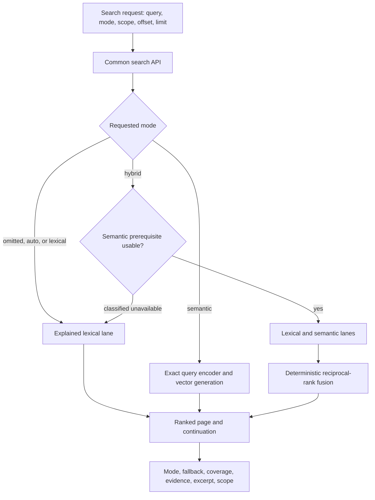

# Semantic and Hybrid Document Retrieval - Plan

## Goal Capsule

- **Objective:** Agents can find the right DocBank document from ordinary wording, including nearby concepts and abbreviations, while exact lexical search remains deterministic and usable without embeddings.
- **Means:** Publish the existing explained retrieval engine through DocBank's common search API, client, and CLI, reusing the pageable evidence and typed-scope contracts from issues #13 and #14. (KTD1, KTD2)
- **Authority:** GitHub issue #1 and its 2026-09-20 acceptance comment govern behavior; the active issue #13 pagination and issue #14 scope work govern continuation and scope naming once their contracts are published; current repository invariants govern storage, evidence, and embedding safety.
- **Execution profile:** One direct roll-forward feature branch with synthetic fixtures; no new service, workflow engine, rollout layer, or PersonalOS change.
- **Stop conditions:** Stop if the pagination or scoped-discovery dependency adopts a contract that cannot compose with the existing retrieval engine, or if exposing semantic retrieval would require weakening descriptor, source-version, vector-generation, or evidence authority.
- **Finisher:** The implementing agent owns code, tests, documentation, pull request, and CI through a decided result. Merge and deployment remain with the user.

---

## Product Contract

### Summary

Extend DocBank's common evidence-bearing search contract so callers can request `lexical`, `semantic`, `hybrid`, or `auto` retrieval and receive ranked, bounded, pageable results with transparent execution state.

### Problem Frame

DocBank already implements explained lexical, semantic, and reciprocal-rank-fused hybrid retrieval internally, but production callers can only reach lexical routes. As a result, ordinary descriptive wording fails when a filename or OCR uses an abbreviation or related concept, even though the vector, evidence, coverage, filtering, and ranking machinery already exists.

### Requirements

**Retrieval behavior**

- R1. The common search request accepts `lexical`, `semantic`, `hybrid`, and `auto`, and the response always states requested and actual mode.
- R2. Lexical mode preserves the existing name-before-content BM25 ordering, deterministic ties, bounded excerpts, immutable evidence identity, and exact filters.
- R3. Semantic mode uses only the configured exact query-capable descriptor, active vector generation, current live content versions, and requested scope; unavailable or corrupt authority fails explicitly.
- R4. Hybrid mode uses the existing independent lane limits and deterministic reciprocal-rank fusion without comparing raw lexical and vector scores.
- R5. Omitted mode and `auto` remain lexical and never send query text to an embedding provider; the response still distinguishes the requested and actual mode and reports that no fallback occurred.
- R6. Hybrid may fall back to lexical only for a classified unavailable semantic prerequisite and must report the reason; provider execution failures, corrupt indexes, stale authority, and lease-release failures remain errors.

**Agent evidence and navigation**

- R7. Every hit returns stable vault/node/content-version identity, rank and lane contributions, path, and immutable lexical or embedding evidence references; lexical/shared hits include bounded excerpts while semantic-only hits omit an excerpt rather than inventing a matching span.
- R8. Responses return coverage counts/state, fallback state, truncation, limit, offset, and continuation using the landed issue #13 names and semantics.
- R9. Tag, MIME type, typed `under_node_id`, and modification-time scope apply identically to lexical and semantic lanes and are echoed in the response.
- R10. Continuation is bounded by the stable ranked candidate universe and never promises an exact total the engine cannot prove.

**Operational behavior**

- R11. A daemon with no embedding runtime, completed embedding heads, or active vector index remains fully usable for lexical search.
- R12. Public callers do not provide internal fingerprints, vector-space IDs, authorization fingerprints, credentials, or provider limits.
- R13. Browser-session credentials remain lexical-only; semantic and hybrid requests require the master API credential so a lower-privileged browser token cannot trigger provider egress or quota use.

### Acceptance Examples

- AE1. **Covers R1-R7.** Given synthetic evidence named `Registration Exp. Date`, semantic or hybrid search for `annual registration expiration` returns that document with stable evidence, while lexical mode retains its deterministic literal behavior.
- AE2. **Covers R5, R11.** Given no usable embedding runtime or index, omitted and automatic requests remain lexical without invoking an encoder; a hybrid request returns lexical with requested/actual mode plus a sanitized fallback reason.
- AE3. **Covers R6.** Given a corrupt or stale vector generation, hybrid search returns an error rather than presenting lexical fallback as a healthy semantic attempt.
- AE4. **Covers R8-R10.** Given more ranked results than the requested page size, following `next_offset` returns the next bounded page without duplicates under unchanged authority; a changed authority follows the adopted continuation reconciliation behavior.
- AE5. **Covers R7, R9.** Given a directory scope, results from both lanes stay below that live directory; lexical and fused hits carry bounded UTF-8 excerpts, while semantic-only hits carry immutable embedding evidence without a fabricated excerpt.
- AE6. **Covers R13.** Given a valid browser-session credential, semantic and hybrid requests fail before encoder invocation while lexical and automatic requests retain existing access.

### Scope Boundaries

- In scope: DocBank API, Go client, CLI, OpenAPI, daemon wiring, internal retrieval fallback/continuation metadata, and synthetic tests.
- Deferred: typed enrichment fields such as plate, VIN, document date, capture date, and vehicle association until an adopted enrichment authority exists.
- Separate work: recursive inventory from issue #14 and PersonalOS MCP pass-through from its item 4 task.
- Out of scope: a new embedding provider service, workflow engine, feature flags, compatibility shims, migrations, dashboards, rollout ceremony, deployment, or merge.

### Dependencies

- Issue #13 must publish the common evidence-bearing `offset` / `next_offset` contract before shared API/client/CLI files are edited.
- Issue #14 supplies typed `under_node_id` scope and recursive inventory remains a distinct operation.
- Semantic execution requires a configured query-capable local runtime, matching processing profile and binding authority, completed embedding heads, and an active vector index generation.

---

## Planning Contract

### Key Technical Decisions

- KTD1. **Extend the common search contract.** Build on the evidence-bearing `/api/v1/search` response from issue #13 instead of adding a third search route or parallel DTO.
- KTD2. **Reuse the existing retrieval engine end to end.** `internal/retrieval.Searcher`, store authority, vector index, evidence resolution, filters, and reciprocal-rank fusion remain the implementation source of truth.
- KTD3. **Resolve one semantic binding inside the daemon.** Select exactly one configured query-capable processing-profile binding deterministically; none or ambiguity makes semantics unavailable. Public callers never choose internal fingerprints.
- KTD4. **Make fallback narrow and typed.** A small sanitized fallback enum distinguishes missing runtime, binding, coverage authority, or active index. Integrity and execution failures are not fallback conditions.
- KTD5. **Page the final ranked universe.** Add offset-aware slicing after deterministic ranking, request enough candidates for `offset + limit` within the existing 1,000-candidate ceiling, and reuse issue #13 continuation fields and reconciliation rules.
- KTD6. **Keep excerpts tied to match evidence.** Prefer the lexical excerpt on fused hits and leave semantic-only excerpts empty because embedding evidence identifies the vector input, not a precise matching span; do not rerun OCR, chunking, or full-document hydration.

### High-Level Technical Design

### Assumptions

- The issue #13 implementation will use numeric `offset` and `next_offset`, deterministic current-authority reads, and no opaque cursor. Re-inspect its open PR before implementation and adopt its exact field and mismatch behavior.
- The issue #14 implementation will keep `under_node_id` as the typed directory scope and echo the resolved scope.
- Semantic-only results may omit excerpts because their immutable embedding evidence has no exact matching text span; lexical and fused results retain the existing bounded excerpt.

### Sequencing

Land or base on pagination first, then scoped discovery if it changes shared search files. Implement internal mode/fallback/page behavior before exposing it through the daemon and public surfaces, so every outer-layer test targets one settled engine contract.

---

## Implementation Units

### U1. Add offset-aware fallback and evidence behavior to retrieval

- **Goal:** Make the existing retrieval report sufficient for the common pageable public contract.
- **Requirements:** R1-R10; AE1-AE5.
- **Dependencies:** Landed issue #13 contract.
- **Files:** `internal/retrieval/types.go`, `internal/retrieval/search.go`, `internal/retrieval/fusion.go`, `internal/retrieval/search_test.go`, `internal/store/search.go`, `internal/store/search_test.go`.
- **Approach:** Add offset/continuation and typed fallback metadata around the current lanes. Classify only unavailable prerequisites as fallback, keep integrity failures fatal, preserve independent hybrid lane ceilings, retain lexical excerpts on lexical/fused hits, and leave semantic-only excerpts empty.
- **Patterns to follow:** Existing `Report`, `Coverage`, `EvidenceReference`, `SearchExplainedLexicalCandidates`, source-manifest fencing, and issue #13 page metadata.
- **Execution note:** Extend the synthetic retrieval fixtures first so fallback, page boundaries, and nearby-concept behavior fail before implementation.
- **Test scenarios:**
  - Covers AE1. A deterministic fake encoder maps ordinary wording near an abbreviated synthetic filename/OCR result; semantic and hybrid rank it while lexical order remains unchanged.
  - Covers AE2. Missing runtime, missing binding authority, and missing active index return typed hybrid lexical fallback; omitted, auto, and lexical modes never invoke an encoder.
  - Covers AE3. Corrupt generation, stale manifest, provider failure, and lease-release failure remain errors.
  - Covers AE4. Offset pages over lexical, semantic, and fused results have no duplicates under unchanged authority and stop at the bounded candidate universe.
  - Covers AE5. Tag, MIME, directory, and modification filters constrain both lanes; lexical/fused excerpts remain valid UTF-8 and bounded, and semantic-only results omit excerpts.
- **Verification:** Focused retrieval/store suites prove deterministic ranks, fallback classification, coverage, evidence authority, and continuation.

### U2. Expose the exact query encoder and configure the daemon searcher

- **Goal:** Give the daemon one production retrieval service without creating a new provider or workflow layer.
- **Requirements:** R3-R6, R11-R12.
- **Dependencies:** U1.
- **Files:** `internal/processing/embedding_runtime.go`, `internal/processing/embedding_worker.go`, `internal/processing/embedding_worker_test.go`, `cmd/docbank/embedding_runtime.go`, `cmd/docbank/daemon.go`, `cmd/docbank/daemon_embedding_worker_test.go`.
- **Approach:** Add an exact-descriptor `ResolveQueryEncoder` seam over the existing provider runtime registry. Resolve a single query-capable configured processing-profile binding at startup, construct authorization from its validated limits, and inject the resulting search service into the API; lexical-only startup remains valid.
- **Patterns to follow:** Descriptor fingerprint registration, provider equality checks, `config.ProcessingProfile`, daemon optional-job wiring, and immutable authorization limits.
- **Test scenarios:**
  - One exact descriptor returns its provider and rejects descriptor drift or a provider without text-query support.
  - No eligible binding keeps daemon startup and lexical search healthy.
  - Exactly one eligible binding enables semantic search; multiple eligible bindings produce deterministic semantic-unavailable state rather than first-map-entry selection.
  - Credentials remain environment-resolved and no secret appears in API errors or logs.
- **Verification:** Runtime registry and daemon tests prove exact selection, lexical-only startup, and no credential disclosure.

### U3. Extend the API and Go client contract

- **Goal:** Publish one validated response shape for all retrieval modes and scopes.
- **Requirements:** R1-R13; AE2-AE6.
- **Dependencies:** U1, U2, landed issue #13 and #14 shared contract changes.
- **Files:** `internal/api/server.go`, `internal/api/types.go`, `internal/api/routes_read.go`, `internal/api/routes_read_test.go`, `internal/api/openapi_test.go`, `internal/client/client.go`, `internal/client/client_test.go`.
- **Approach:** Extend the common search request/response with mode, ranks, coverage, fallback, evidence, excerpts, and continuation while retaining the adopted filter and page fields. Keep validation in the client as strict as the server, map internal failures to sanitized API errors, and reject semantic/hybrid browser-session requests before retrieval so only the master API credential can trigger provider egress.
- **Patterns to follow:** Existing Huma route registration, evidence-search authority validation, `FromStoreError`, and issue #13 filter/page validation.
- **Test scenarios:**
  - Each mode round-trips requested/actual mode, result ranks, coverage, fallback, evidence, excerpt, and scope through HTTP and client validation.
  - Invalid modes, offsets, limits, and mismatched response authority fail closed.
  - Lexical operation succeeds when the retrieval dependency has no semantic capability.
  - Covers AE6. Browser sessions receive a forbidden response for semantic/hybrid before encoder invocation, while master API authentication can use every mode.
  - OpenAPI documents the enum, bounds, evidence variants, coverage, fallback reasons, and continuation fields.
- **Verification:** API route, client, and OpenAPI tests agree on one contract with no second semantic endpoint.

### U4. Add the practical CLI surface and operator documentation

- **Goal:** Let operators and agents request modes and inspect retrieval state without knowing internal profile identifiers.
- **Requirements:** R1-R13; AE1-AE6.
- **Dependencies:** U3.
- **Files:** `cmd/docbank/search.go`, `cmd/docbank/cli_test.go`, `cmd/docbank/openapi_cli_test.go`, `docs/usage/searching.md`, `docs/configuration.md`.
- **Approach:** Add `--mode`, retain existing scope/filter flags, adopt pagination's offset control, and render compact rank/mode/fallback/coverage information while JSON exposes the full contract. Document that omitted and automatic modes are lexical, semantic/hybrid may use an embedding provider, and the embedding/index prerequisites are operator-owned.
- **Patterns to follow:** Existing daemon-first CLI client, JSON output, tabular search output, and strict documentation build.
- **Test scenarios:**
  - `--mode lexical|semantic|hybrid|auto` sends the expected request and renders requested/actual state.
  - Paginated scoped search composes `--under`, filters, mode, limit, and offset without bypassing node resolution.
  - JSON retains all evidence and continuation fields while human output stays bounded.
  - Invalid modes and unavailable explicit semantic search return actionable errors without provider details or secrets.
- **Verification:** CLI tests and strict docs build prove the usable surface and runtime prerequisite guidance.

---

## Verification Contract

| Gate | Scope | Completion signal |
| --- | --- | --- |
| Focused behavior | U1-U4 | Retrieval, store, runtime, API, client, and CLI tests cover AE1-AE5 with sanitized fixtures. |
| Supported SQLite modes | All | `make test` passes with the required `fts5` tag and `CGO_ENABLED=0 go test -tags fts5 ./...` passes. |
| Static quality | All | `make lint` and `prek run` pass. |
| Documentation | U3-U4 | `make docs-build` and OpenAPI conformance tests pass without warnings. |
| Contract inspection | All | The final diff reuses the landed issue #13/#14 continuation and scope fields and contains no parallel retrieval route, new service, PersonalOS change, or private fixture data. |

---

## Definition of Done

- U1-U4 satisfy their requirements and test scenarios.
- Ordinary synthetic wording finds the abbreviation/nearby-concept document in semantic or hybrid mode, and lexical results remain deterministic.
- Requested/actual mode, fallback, coverage, evidence/excerpt, scopes, and continuation survive API, client, and CLI round trips.
- Lexical search works with no embedding runtime or index; explicit semantic integrity failures are not hidden by fallback.
- Browser-session credentials cannot trigger semantic provider egress; master API authentication retains the full mode surface.
- Runtime and index prerequisites are documented separately from implemented behavior.
- Full repository gates pass in both supported SQLite modes.
- Dead-end or experimental code is removed from the branch.
- The branch is committed and pushed, an open PR references issue #1 and its producer dependencies, and CI reaches a decided result without merging or deploying.
